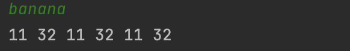

```.py
high = [3,3,1,2,4,3,3,3,1,2,3,2,4,3,1,2,2,3,1,2,1,2,4,2,3,3]
low = [2,2,1,2,2,2,2,2,2,2,3,1,3,2,1,2,2,2,1,2,2,2,4,2,2,3]
a = str(input()).lower()
out = ''
count = 0
for x in a:
    count = 0
    for i in 'abcdefghijklmnopqrstuvwxyz':
        count += 1
        if i == x:
            out += str(high[count])
            out += str(low[count])
            out += ' '
print(out)
```



