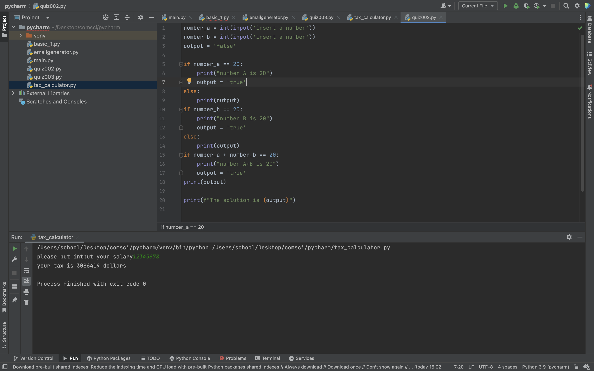
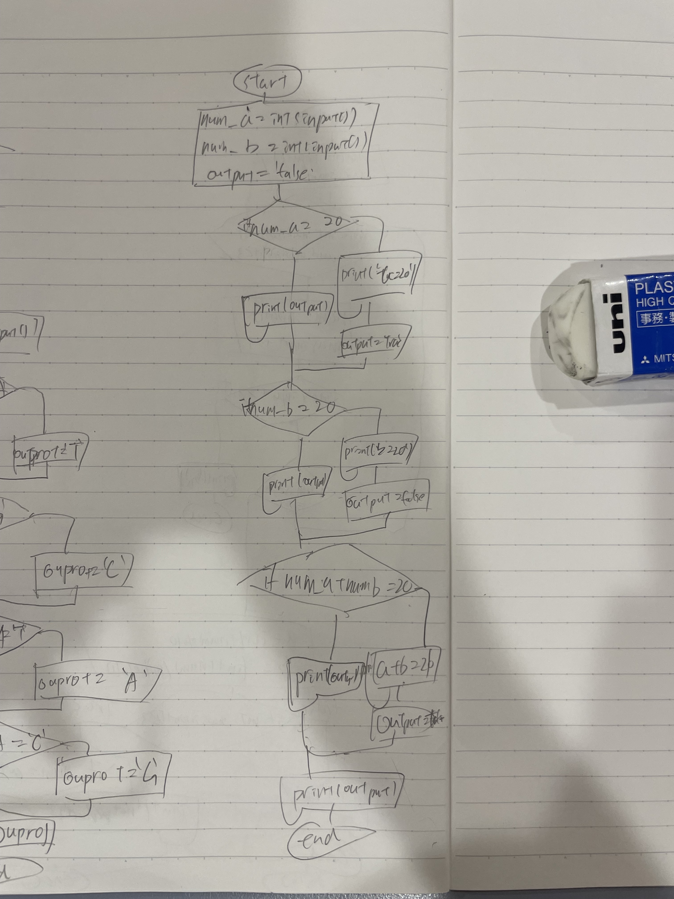

```.py
number_a = int(input('insert a number'))
number_b = int(input('insert a number'))
output = 'false'

if number_a == 20:
    print("number A is 20")
    output = 'true'
else:
    print(output)
if number_b == 20:
    print("number B is 20")
    output = 'true'
else:
    print(output)
if number_a + number_b == 20:
    print("number A+B is 20")
    output = 'true'
print(output)

print(f"The solution is {output}")
```



