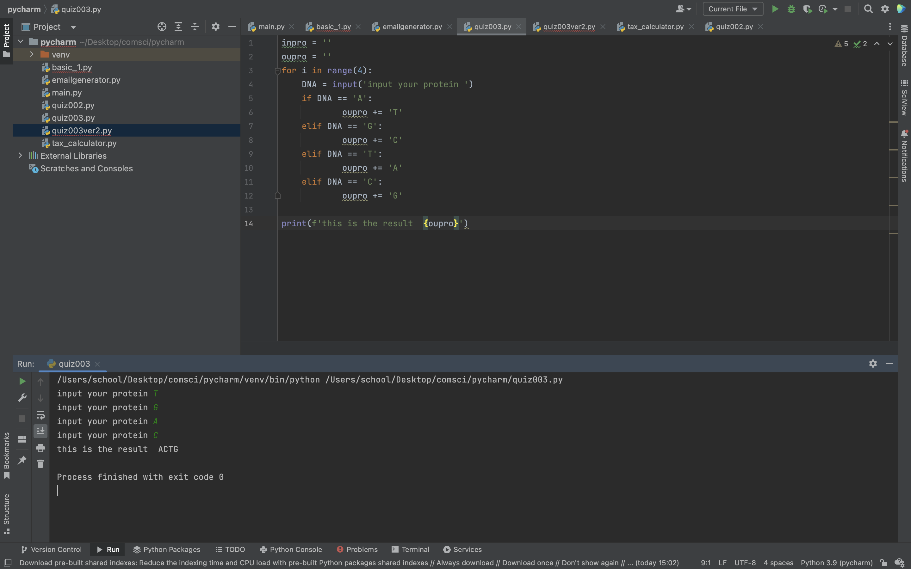

```.py
inpro = ''
oupro = ''
for i in range(4):
    DNA = input()
    if DNA == 'A'or'G'or'T'or'C':
        if DNA == 'A':
            oupro += 'T'
        elif DNA == 'G':
            oupro += 'C'
        elif DNA == 'T':
            oupro += 'A'
        elif DNA == 'C':
            oupro += 'G'
    else:
        print('please input again')

print(oupro)
```

