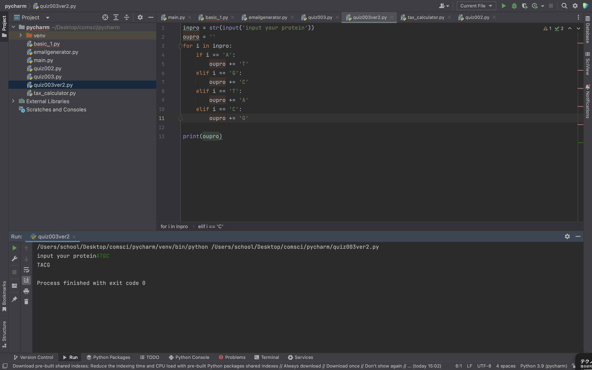

```.py
inpro = str(input('input your protein'))
oupro = ''
for i in inpro:
    if i == 'A':
        oupro += 'T'
    elif i == 'G':
        oupro += 'C'
    elif i == 'T':
        oupro += 'A'
    elif i == 'C':
        oupro += 'G'

print(oupro)
```

