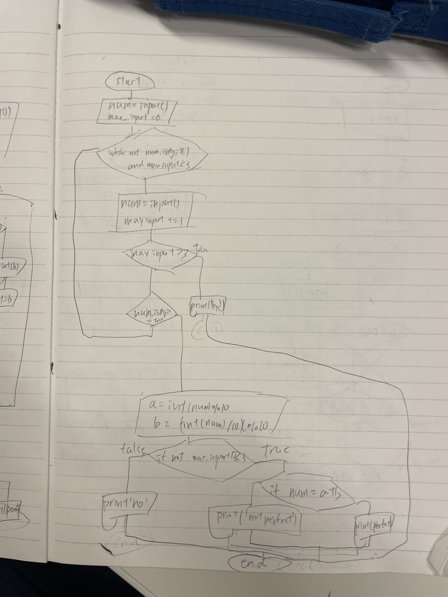

```.py
number = input('Please put integer')
max_input = 0
while not number.isdigit() and max_input < 3 :
    number = input('Please reput a integer')
    max_input += 1
    if max_input > 3:
        print('bye')
        break
    if number.isdigit() == True:
        break
a = int(number) % 10
b = int(int(number)/10) % 10
if not max_input >= 3:
    if number == int(number) % 10 + int(int(number)/10) % 10:
        print('Perfect')
    else:
        print('Not Perfect')
#    print('a')
else:
    print('no')
```


