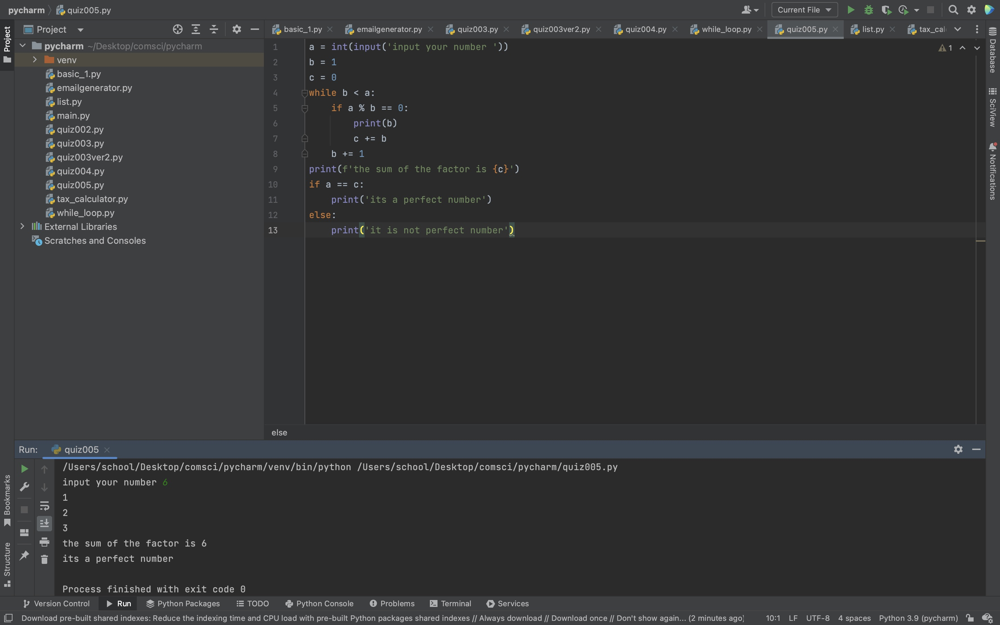
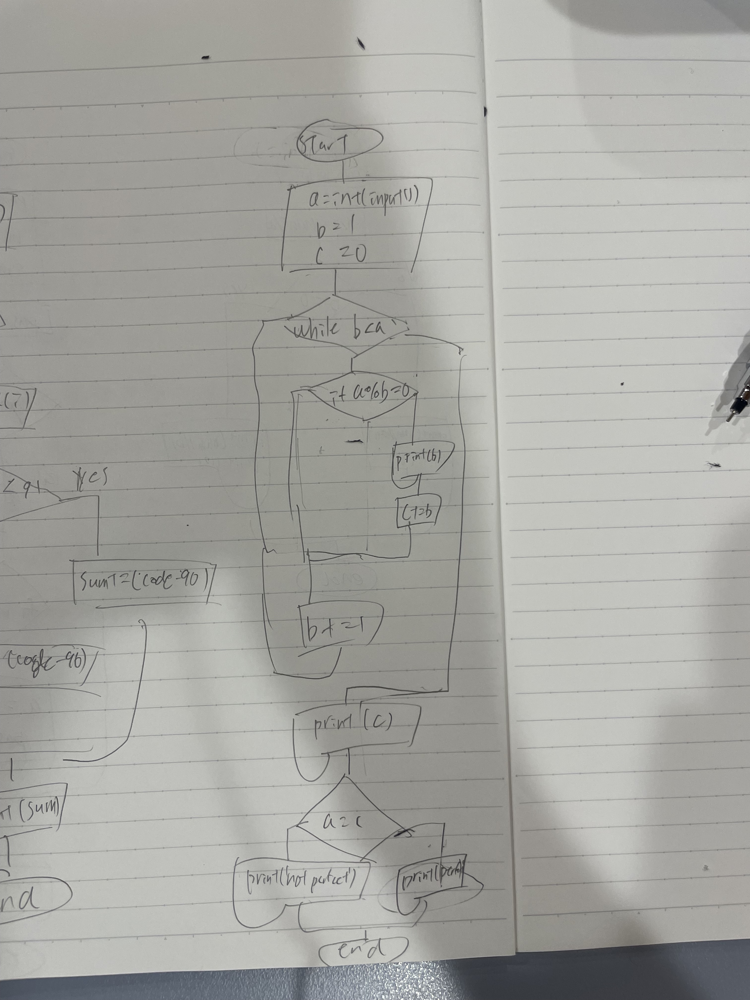

```.py
number = int(input('input your number '))
factor = 1
sum_factor = 0
while factor < number:
    if number % factor == 0:
        print(factor)
        sum_factor += factor
    factor += 1
print(f'the sum of the factor is {sum_factor}')
if number == sum_factor:
    print('its a perfect number')
else:
    print('it is not perfect number')
```


