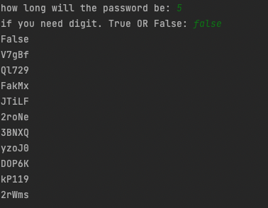

```.py
import random


password = str()
num = int(input('put in the length'))
sym = input('Do you want symbols')

pas = ['a','b','c','d','e','f','g','h','i','j','k','l','m','n','o','p','q','r','s','t','u','v','w','x','y','z','0','1','2','3','4','5','6','7','8','9']
if sym == 'yes':
    pas.extend(['!','#','$','%'])
for i in range(num):
    a = random.choice(pas)
    password += a
print('\033[34m' + password + '\033[0m')
```

