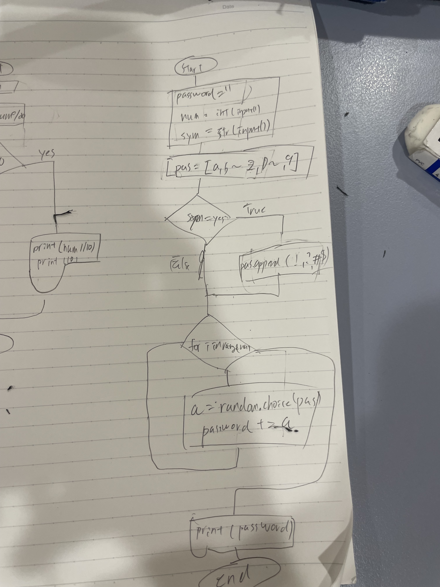

```.py
import random
from library import color
password=[]
num_digits= int(input("how long will the password be: "))
if_symbols=input('if you need digit. True OR False: ')
code = ''

print(if_symbols.title())
for i in range(10):
    password = []
    code = ''
    for x in range(num_digits):
        digit = int(random.randint(48, 122))
        if if_symbols.title()=="False":
            while (57 < digit < 65) or (90 < digit < 97):
                digit = int(random.randint(48, 122))
            password.append(chr(digit))
        elif if_symbols.title()=="True":
            password.append(chr(digit))
    for i in password:
        code += i
    print(color(code,'red'))
```
# library
```.py
def color (a,color):
    ce = '\033[0m'
    if color == 'black':
        cs ='\033[30m'
    if color == 'red':
        cs = '\033[31m'
    if color =='green':
        cs = '\033[32m'
    if color == 'yellow':
        cs = '\033[33m'
    if color == 'blue':
        cs = '\033[34m'
    if color == 'purple':
        cs = '\033[35m'
    if color == 'cyan':
        cs = '\033[36m'
    if color == 'white':
        cs = '\033[37m'
    return cs+a+ce
```


