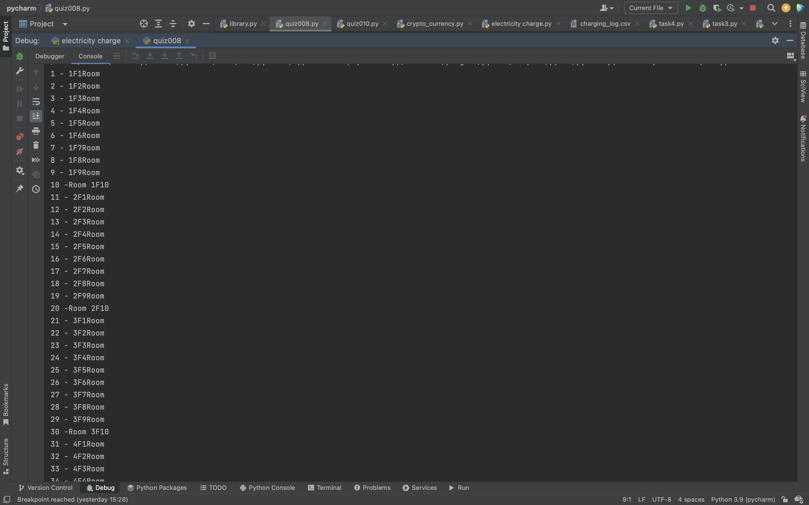

```.py
a = int(input())
b = a%10
if b == 0:
    print(f'{a} - {a//10}F Room10')
else:
    print(f'{a} - {a//10+1}F Room{a%10}')
```


```.py
for i in range(1,101):
    c = i%10
    if c == 0:
        print(f'{i} -Room {i//10}F10')
    else:
        print(f'{i} - {i//10+1}F{i%10}Room')
```


