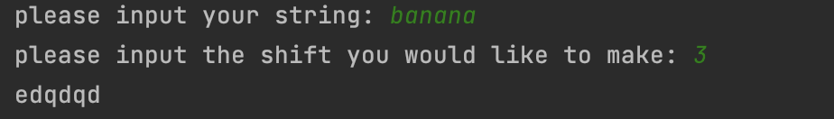

### code
```.py
string=input("please input your string: ").lower()
shift=int(input("please input the shift you would like to make: "))%26
message = ''
for letter in string:
    ord_1=ord(letter)
    if ord_1==32:
        ord_2=32
    else:
        ord_2=ord_1+shift
        if ord_2>122:
            ord_2-=26
    message += chr(ord_2)

print(message)
```
### result
```.py
please input your string: banana
please input the shift you would like to make: 3
edqdqd

Process finished with exit code 0
```


