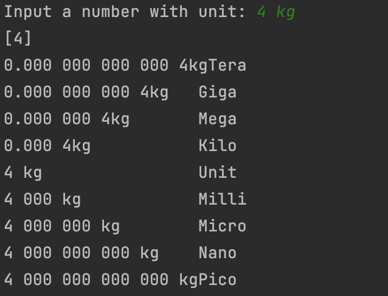

### code
```.py
s = input("Input a number with unit: ")
s = s.split(' ')
n = [int(i) for i in s if i.isdigit()]
print(n)
powers = []
final = []
Units = ["Tera", "Giga", "Mega", "Kilo", "Unit", "Milli", "Micro", "Nano", "Pico"]
length_lmsg = 20


def power(n):
    count = 0
    for i in range(-12, 0, 3):
        temp = abs(i // 3)
        number = f"0.{(('000 ') * temp)}{str(n[0])}{str(s[-1])}".ljust(length_lmsg)
        powers.append(f"{number}{Units[count]}")
        count += 1
    for i in range(0, 15, 3):
        temp = i//3
        number = f"{str(n[0])} {('000 '*temp)}{str(s[-1])}".ljust(length_lmsg)
        powers.append(f"{number}{Units[count]}")
        count += 1

    return powers
for i in power(n):
    print(i)
```
### result

