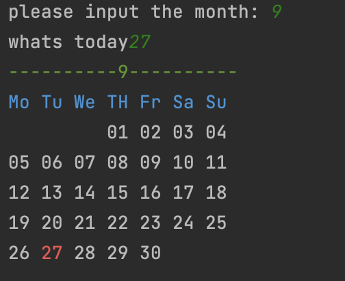

## code
```.py
from library import best_month

best_month(int(input('please input the month: ')),input('whats today'))
```
## library
```.py
def color (a,color):
    ce = '\033[0m'
    if color == 'black':
        cs ='\033[30m'
    if color == 'red':
        cs = '\033[31m'
    if color =='green':
        cs = '\033[32m'
    if color == 'yellow':
        cs = '\033[33m'
    if color == 'blue':
        cs = '\033[34m'
    if color == 'purple':
        cs = '\033[35m'
    if color == 'cyan':
        cs = '\033[36m'
    if color == 'white':
        cs = '\033[37m'
    return cs+a+ce
 
def best_month(a,b):
    #1/1 is saturday
    month = int(a)
    week = ''
    count = 0
    day = 0
    date = [0,31, 28, 31, 30, 31, 30, 31, 31, 30, 31, 30, 31]
    th = []
#    print(date[a])
    for i in range(((sum(date[:a])+1)%7+4)%7):
        th.insert(0, '  ')
    for x in range(int(date[a])):
        day += 1
        th.append(str(day))
    for d in th:
        if len(d) < 2:
            week += '0'

        if d ==b:
            week += color(str(d),'red')
        else:
            week += d
        week += ' '
        count += 1
        if count%7 == 0:
            week += '\n'
    print(color(str(a).center(21,'-'),'green'))
    print(color('Mo Tu We TH Fr Sa Su','blue'))
    return print(week)
```

