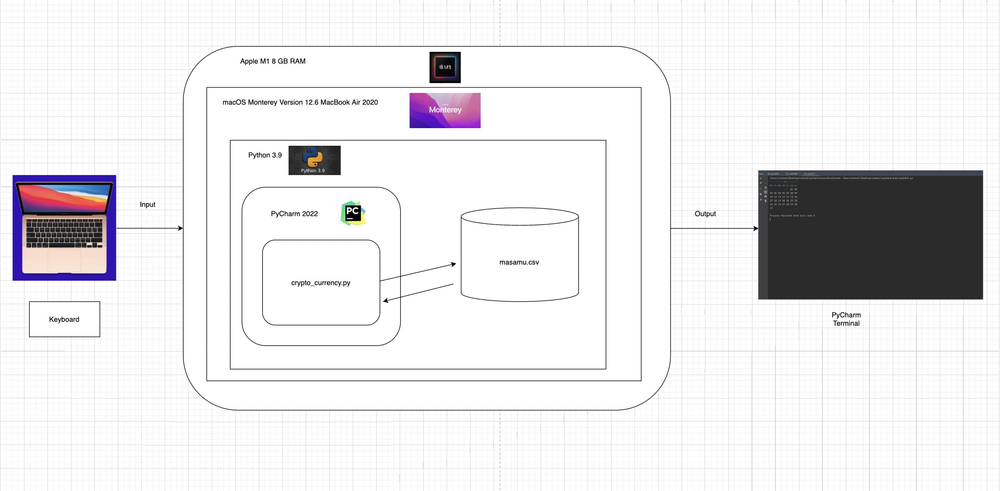
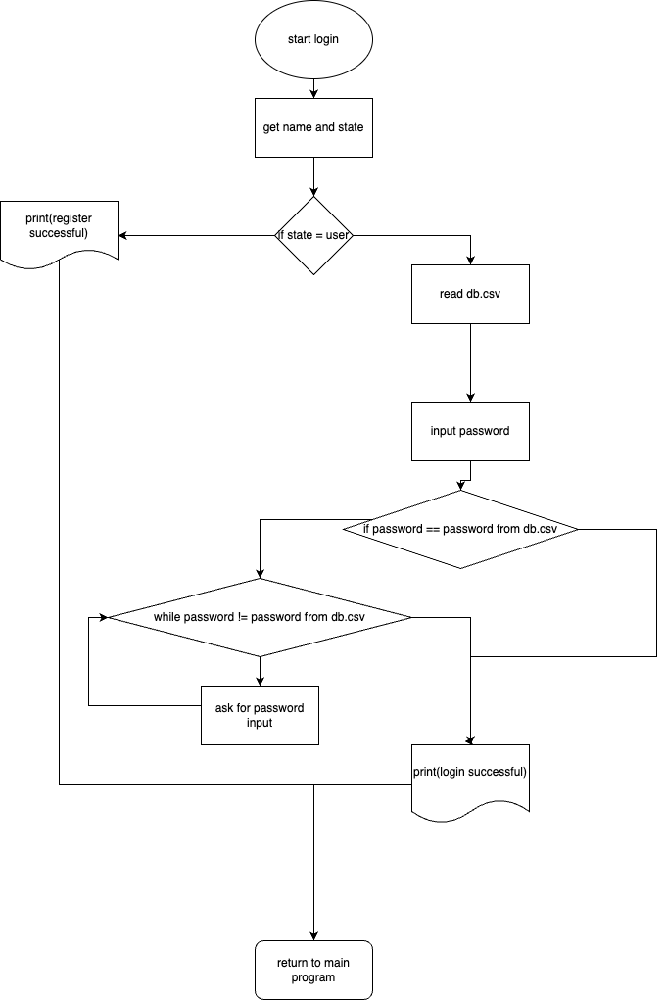
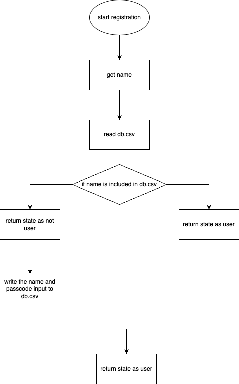
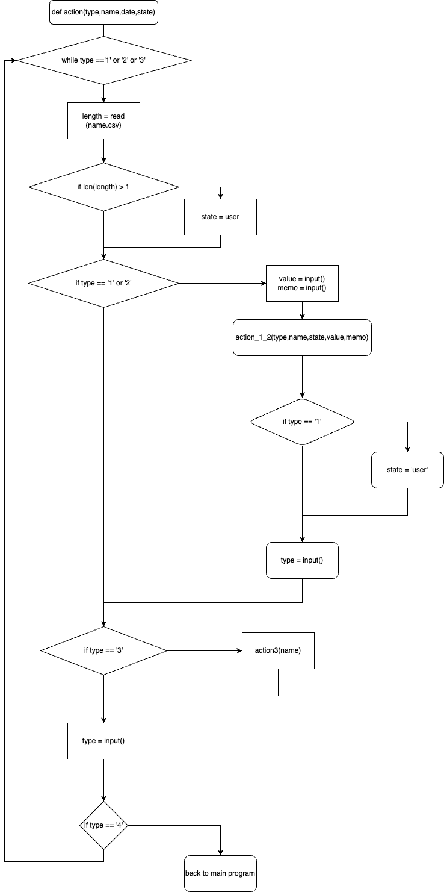
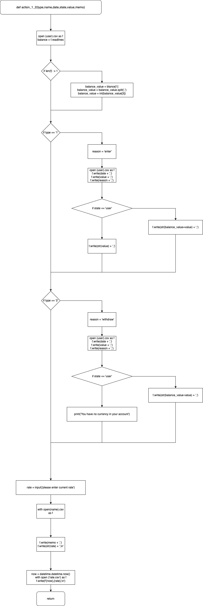
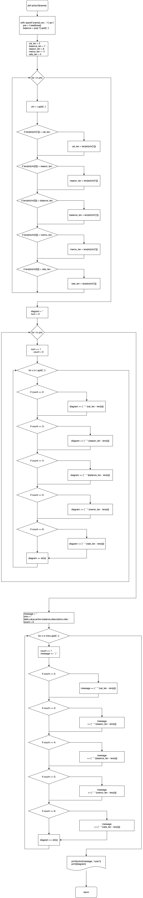

# Crypto Wallet
# Criteria A: Planning

## Problem definition

Ms. Sato is a local trader who is interested in the emerging market of cryptocurrencies. She has started to buy and sell electronic currencies, however at the moment she is tracking all his transaction using a ledger in a spreadsheet which is starting to become burdensome and too disorganized. It is also difficult for Ms Sato to find past transactions or important statistics about the currency. Ms Sato is in need of a digital ledger that helps her track the amount of the cryptocurrency, the transactions, along with useful statistics. 

Apart for this requirements, Ms Sato is open to explore a cryptocurrency selected by the developer.

## Proposed Solution

Design statement:
I will to design and make a electronic ledger for a client who is a crypto trader. The ledger will about managing transaction and statistics and is constructed using the software pycharm. It will take  a few days to make and will be evaluated according to the criteria bellow.

The crypto I am treating is Cardano
Cardano is a blockchain platform for changemakers, innovators, and visionaries, with the tools and technologies required to create possibility for the many, as well as the few, and bring about positive global change.
https://cardano.org/

| Group 1   |              |   | Group  2  |           |
|-----------|--------------|---|-----------|-----------|
| Developer | Digital Coin |   | Developer | Coin      |
| Alex      | Bitcoin      |   | Alek      | Solana    |
| Bernard   | Ethereum     |   | Mai       | Dogecoin  |
| Yutaro    | Dogecoin     |   | Daniela   | BInance   |
| Verlon    | Apecoin      |   | Kris      | Bitcoin   |
| Oswell    | Tether       |   | Paula     | Lumens    |
| Thumula   | Tron         |   | ZAven     | Ethereum  |
| Ainee     | Mana         |   | Jonathan  | Maker     |
| Lison     | Solana       |   | Kai       | Avalanche |
| Sabu      | Binance      |   | Daiichiro | Flow      |
| Emmy      | Polkadot     |   | Masamu    | Cardano   |
| Maria     | Cardano      |   | Yasmina   | Zcash     |
| Zelan     | Cosmos       |   | Jana      | LiteCoin  |
| Manahil   | BinanceUSD   |   | Lyn       | Iota      |
| Krish     | UsdCoin      |   | Meisa     | Polkadot  |
|           |              |   | Mayte     | Cosmos    |
|           |              |   | Pop       | Ripple    |
Justify the tools/structure of your solution

## Success Criteria
1. The electronic ledger is a text-based software (Runs in the Terminal).
2. The electronic ledger display the basic description of the cyrptocurrency selected.
3. The electronic ledger allows to enter, withdraw and record transactions.
4. The electronic ledger could be used by multipule accounts.
5. The electronic ledger is protected by a encrypted password.
6. The electronic ledger is able to show statics of your account and the currency.

# Criteria B: Design

## System Diagram

## Flow Diagrams







## Record of Tasks
| Task No | Planned Action                  | Planned Outcome                                                                          | Time estimate | Target completion date | Criterion |
|---------|---------------------------------|------------------------------------------------------------------------------------------|---------------|------------------------|-----------|
| 1       | Create system diagram           | To have a clear idea of the hardware and software requirements for the proposed solution | 10min         | Sep 22                 | B         |
| 2       | Interview with the Client       | To discuss client's needs and define success criteria                                    | 5min          | Sep 23                 | A         |
| 3       | Code the introducion                   | Make a breif introduction of this tool and the selecteed crypto currency.                                       | 10min         | Sep 23                 | C         |
| 4       | Code register and login function       | Add a funtion that allows to manage multiple acount with encrypted passcode.            | 60min         | Sep 27                 | C         |
| 5       | Code Main Functions             | A function base of the program                                                           | 4hrs          | Sep 30                 | C         |
| 6       |Create diagram | A function that creates a neet diagram.                                                   | 1hrs          | Oct 1                  | C         |
| 7       | Form Test Plan                  | To a flexible test plan formed                                                           | 1hr           | Oct 1                  | B         |
| 8       | Draw Flow Diagrams              | To have completed the flow diagrams for the functions of the program                     | 1.5hrs        | Oct 3                  | B         |


# Criteria C: Planning

## Tool used in unit 1
### Functions
I used the function tool to manage each user action.
### For/while loops
```.py
while tos == '1' or tos == '2':
    sep()
    if tos == '1':
        type = typecheck(input(color('\nEnter number\n1.enter\n2.withdraw\n3.check balance\n\nnum:','blue')))
        action_general(type,name,date,state)
    if tos == '2':
        statistics(name)
    sep()
    tos = str(input(color('To continue with transaction enter 1\nTo continue statistics enter 2\nTo finish enter 3\n\nEnter: ', 'blue')))
    while tos != '1' and tos != '2' and tos != '3':
        tos = str(input(color('Please enter 1 or 2', 'red')))
    if tos == '3':
        print(color('Thank you for using!','cyan'))

```
I used the while loop and made the ledger able to make continuous tranaction.

```.py
    for i in data:
        namedt = i.split(',')
        #print(namedt)
        #namedt = namedt.split(',')
        if namedt[0] == usrname:
            state = 'user'
            break
```
I used for loops to get info from list more efficiently
### Input Validation
```.py
def typecheck(type):
    while type != '1' and type != '2' and type != '3':
        type = input(color('put a number from 1-3: ', 'red'))
    return type

def isfloat(s):
    try:
        float(s)
    except ValueError:
        return False
    else:
        return True

def typechecka(type):
    while type != '1' and type != '2' and type != '3' and type != '4':
        type = input(color('put a number from 1-3: ', 'red'))
    return type

def checkrate(a):
    while not a.isdigit() and isfloat(a) == False:
        a = input(color('Please enter a integer or float value: ','red'))
    return a

def intcheck(a):
    while not a.isdigit():
        a = input(color('please enter a integer value: ','red'))
    return int(a)
```
I have multiple input validation. Many of them is checking if the input is a integer or not by .isdigit tool.
### If statements
```.py
    if type == '1':
        reason = 'enter'
        with open(f'{name}.csv', 'a') as f:
            f.write(date + ',')
            f.write(str(value) + ',')
            f.write(reason + ',')
            if state == 'user':
                f.write(str(balance_value + value) + ',')
            else:
                f.write(str(value) + ',')
            state = 'user'
```
I used alot of if statement to separate action depending on the situation.

### Encryption
```.py
import hashlib

def hash(code):
    code = hashlib.md5(code.encode()).hexdigest()
    return code
```
Inorder to encrypt my code I used the hash library.


[Video of the Program](https://drive.google.com/file/d/1-MfpzhblU11c-1OaQhpMclTk8itSedwn/view?usp=sharing)
