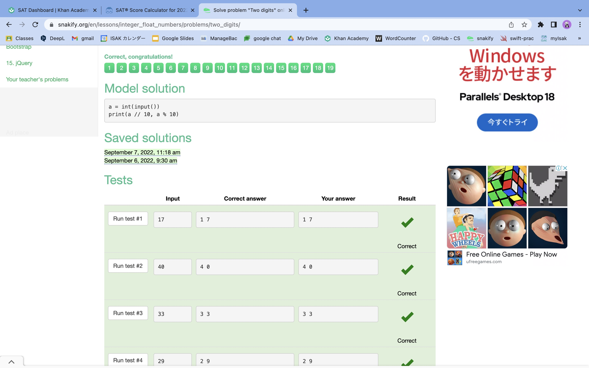
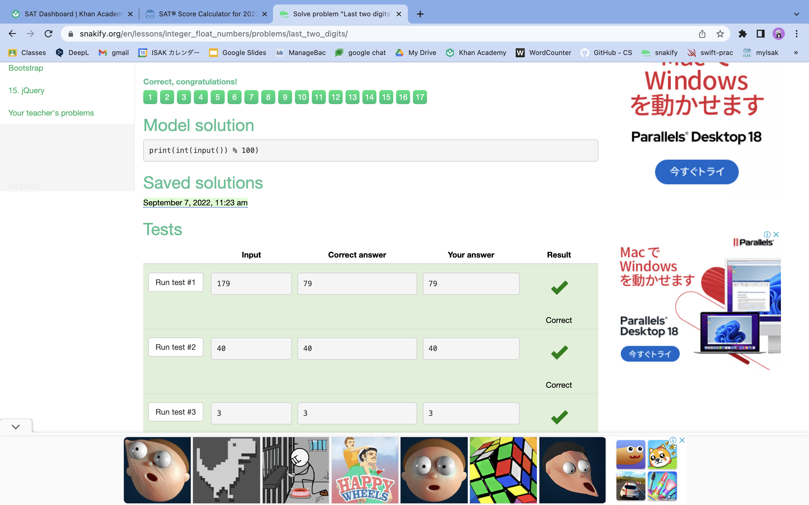
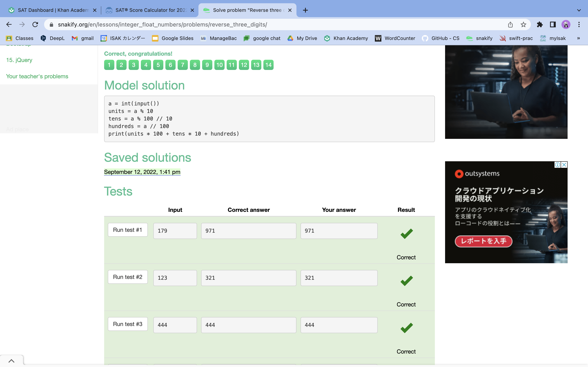
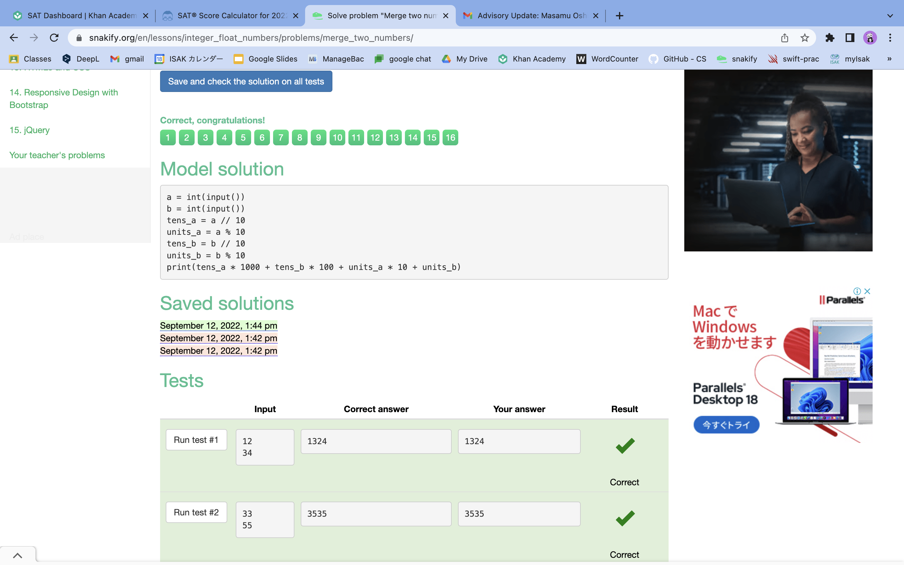
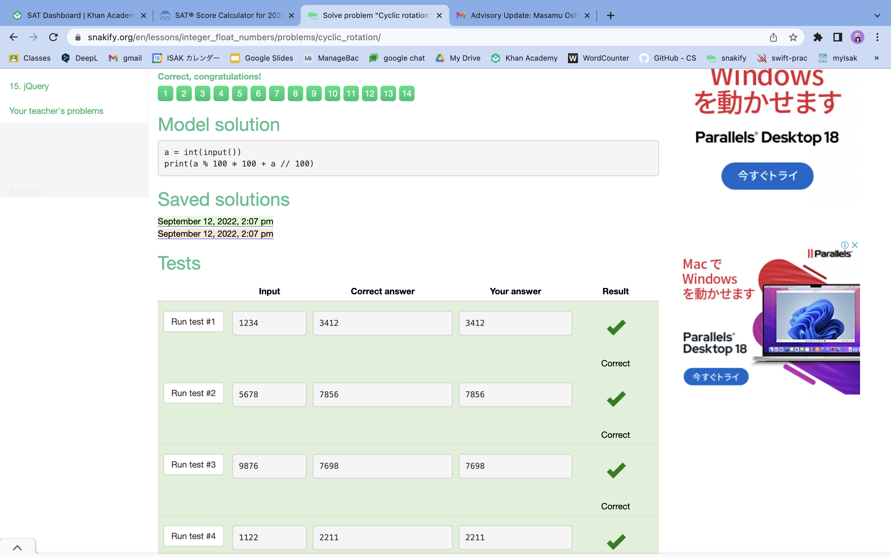
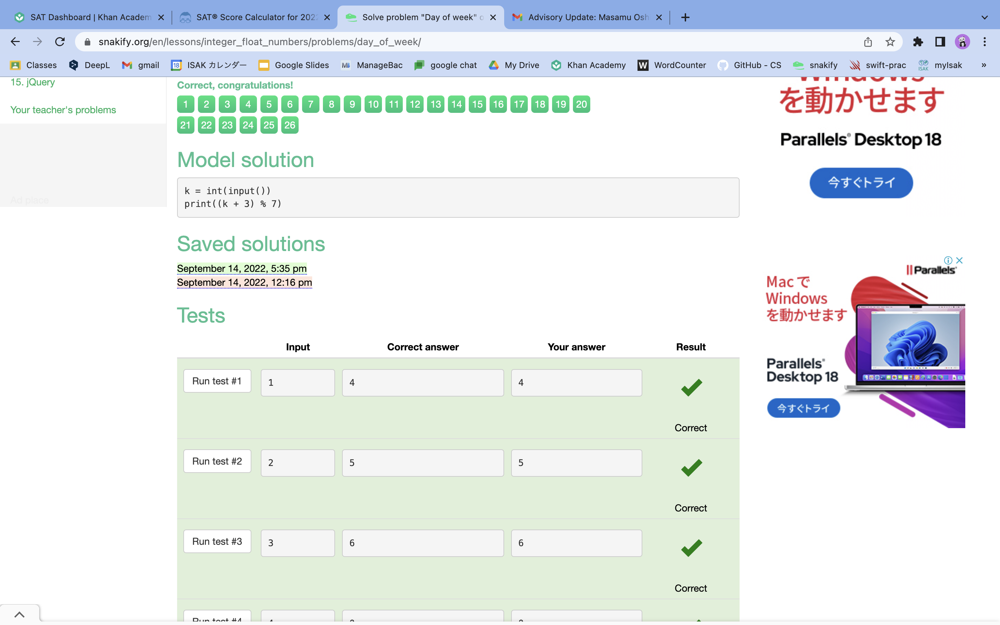
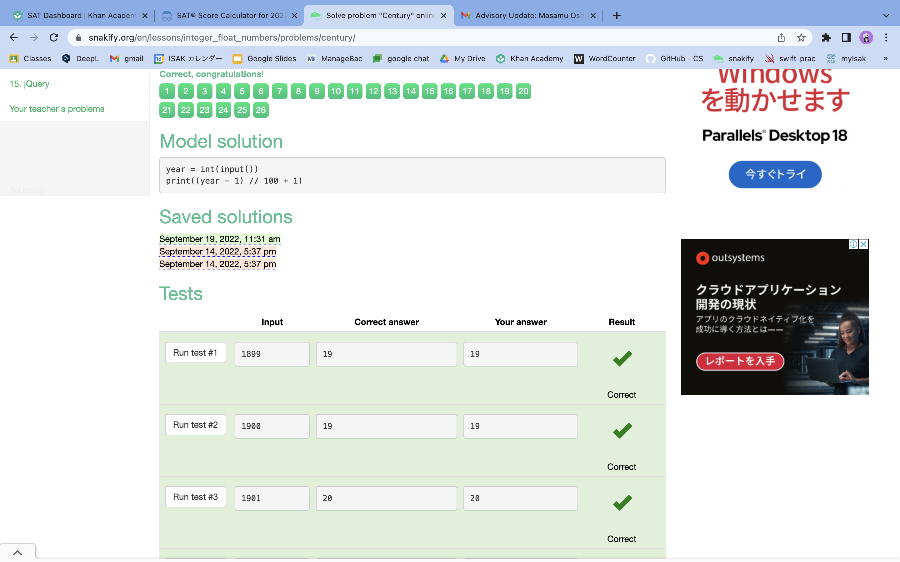
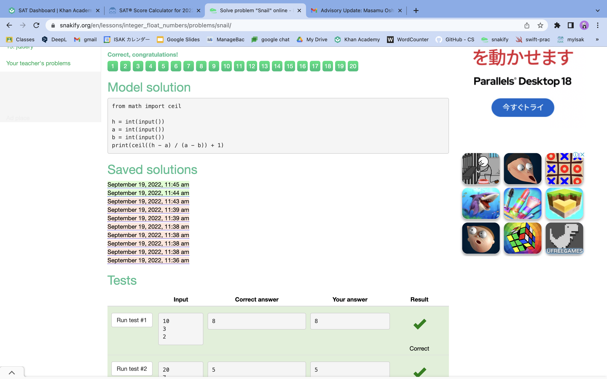

## 1
```.py
a = int(input())
print(int(a/10),int(a%10))
```


## 2
```.py
a = int(input())
print(int(a/10)+a%10*10)
```


## 3
```.py
num = int(input())
print(int(str(num)[-2:]))
```


## 4
```.py
a = int(input())
print(100*((a%100)%10) + a%100 - (a%100)%10 + int(a/100))
```


## 5
```.py
a = int(input())
b = int(input())
print(10*(a//10*100+a%10)+(b//10*100+b%10))
```


## 6
```.py
a = int(input())
print(a%100*100 + (a-a%100)//100)
```


## 7
```.py
k = int(input())
print((k%7+3)%7)
```


## 8
```.py
a = int(input())
print((a-1)//100+1)
```


## 9
```.py
from math import ceil

h = int(input())
a = int(input())
b = int(input())
print(ceil((h-a)/(a-b)) + 1)
```

