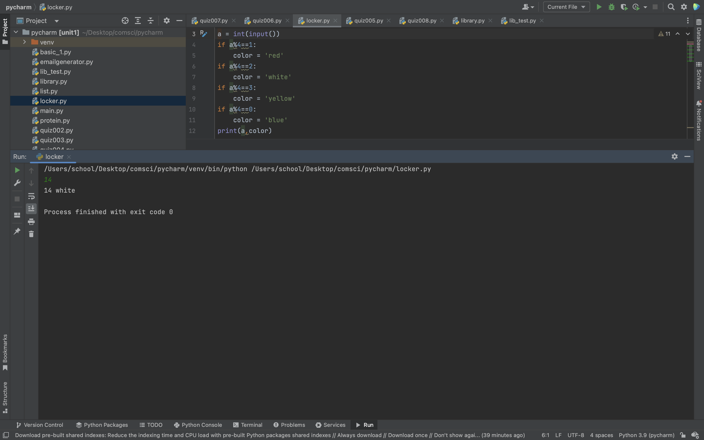
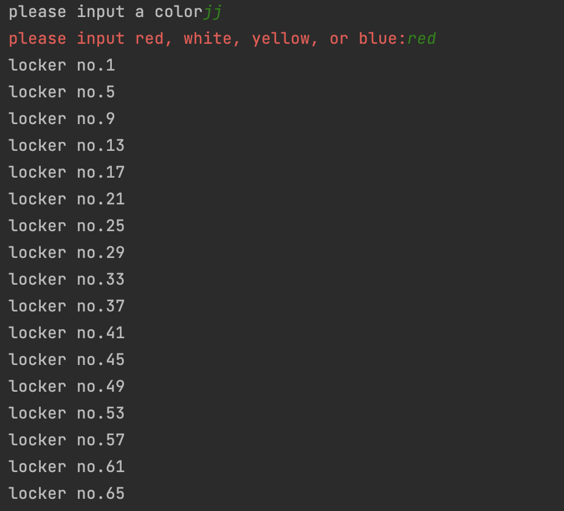
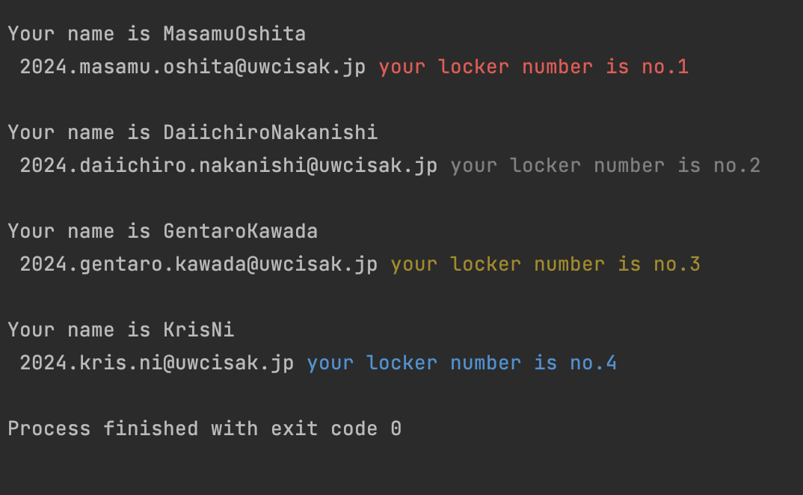

# research task
## Question 1:
The strongest computer is Summit.
I was surprised with it size(7000 square feet)
and how it could predict the deterioration of missles and other fireweapons.
The fact that it will get offline.

## Question 2:
**advantage:**
- speed:
    Super computers are able to conduct programs and simulations way faster than normal comupters. It is able to conduct 10^16 calculation in one               second. This could make many type of simulations possible and contribute to the community and science.
- solving ability:
    As mentioned it could conduct more complex simulation and make studying efficient and effective.

**disadvantage:**
- maintennce:
    Since it is very big and has a complex structure. A number of skilled engineer is needed. These reason makes the maintenance more difficult
- cost:
    In the case of Japanese 'Fugaku' it cost 130billion yen. If you consider trhe maintenance cost the total amount of expence will become a tremendous         number.


## Question 3:
The best computer in Japan is 富岳.
The size is 80cm x 140cm x 220cm and there is 432 of it.
It is located in ポートアイランド,Kobe.
It is used to conduct various types of simulation about things such as, natural disaster, infrustructure, physics and energy creation and distribution.
The max memory has 4.85piB. For float operations the maximum performance is 2.15ExaFLOPS(2.15x10^18 float operation in a second). For intiger operation the maximum performance is 4.30ExaOPS(4.30x10^18 operation in a second).

# coding task

## no.1
```.py
color =str()
num = int(input())
for a in range(1,num+1):
    if a%4==1:
        color = 'red'
    if a%4==2:
        color = 'white'
    if a%4==3:
        color = 'yellow'
    if a%4==0:
        color = 'blue'
    print(a,color)
```


## no.2
```.py
a = int(input())
if a%4==1:
    color = 'red'
if a%4==2:
    color = 'white'
if a%4==3:
    color = 'yellow'
if a%4==0:
    color = 'blue'
print(a,color)
```


## no.3
```.py
from library import color
lcolor = str(input('please input a color')).strip()
lcolor = lcolor.lower()
message = 'please input red, white, yellow, or blue:'
while lcolor.lower() != ('red'or'white'or'yellow'or'blue'):
    lcolor = input(color(message,'red'))
base_num = 0
if lcolor.startswith('r'):
    base_num = 1
if lcolor.startswith('w'):
    base_num = 2
if lcolor.startswith('y'):
    base_num = 3
if lcolor.startswith('b'):
    base_num = 4
while base_num <= 2400:
    print(f'locker no.{base_num}')
    base_num +=4
```


## no.4
```.py
from library import color
with open("student_locker.csv", "r") as file:
    student_info = file.readlines()
count = 0
for i in student_info:
    count+=1
    name = i.split(',')
    fname = name[0].strip()
    lname = name[1].strip()
    if count % 4 == 1:
        col = 'red'
    if count % 4 == 2:
        col = 'white'
    if count % 4 == 3:
        col = 'yellow'
    if count % 4 == 0:
        col = 'blue'
    print(f'\nYour name is {fname}{lname}\n',f'2024.{fname.lower()}.{lname.lower()}@uwcisak.jp',color(f'your locker number is no.{count}',col))
```


