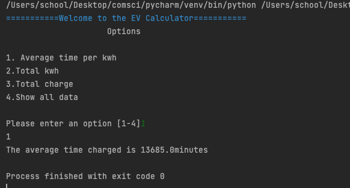
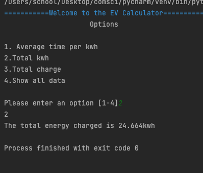
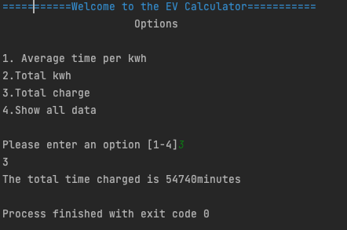
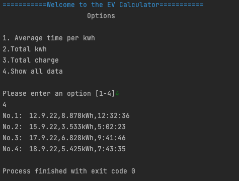

# library
```.py
def validate_int_input(msg):
   "This function validates that the user enters a integer"
   number = msg
   while not number.isdigit():
       number = input(color('Error.' + msg,'red'))
   return number

def total(a,b):
    index = 0
    total = 0
    unit = ''
    message = ''
    for log in b:
        if index > 0:
            values = log.split(",")
            energy = values[1]
            time = values[2]
            if a == 4:
                print(f"No.{index}:　{log}", end="")
            elif a ==2:
                message = 'total energy charged'
                total += float(energy[0:5])
                unit = 'kwh'
            elif a == 1 or 3:
                time_split = time.split(":")
                mins = int(time_split[0]) * 60 * 24 + int(time_split[1]) * 60 + int(time_split[2])
                total += mins
                if a == 3:
                    message = 'total time charged'
                    unit = 'minutes'
        index += 1
    if a == 1:
        message = 'average time charged'
        unit = 'minutes'
        total = int(total)/(index - 1)
    print(unit)
    if a != 4:
        print(f'The {message} is {total}{unit}')
```
# document
```.py
date,charge,duration
12.9.22,8.878kWh,12:32:36
15.9.22,3.533kWh,5:02:23
17.9.22,6.828kWh,9:41:46
18.9.22,5.425kWh,7:43:35

```
# program
```.py
from library import color, validate_int_input, total

welcome_msg = "Welcome to the EV Calculator".center(50, "=")
prompt_msg = "Please enter an option [1-4]"
print(f"{color(welcome_msg,'blue')}")
print("Options".center(50))

menu = """
1. Average time per kwh
2.Total kwh
3.Total charge
4.Show all data
"""

print(menu)
option = int(validate_int_input(input(prompt_msg)))
while not (1 <= int(option) <= 4):
    option = validate_int_input(f"{color(prompt_msg,'red')}")
print(option)
with open("charging_log.csv", "r") as file:
    ev_logs = file.readlines()


#option1: show average time per kwh, #option2: show total kwh, option3: show total charge time, #option4: show all data
total(option,ev_logs)
```




