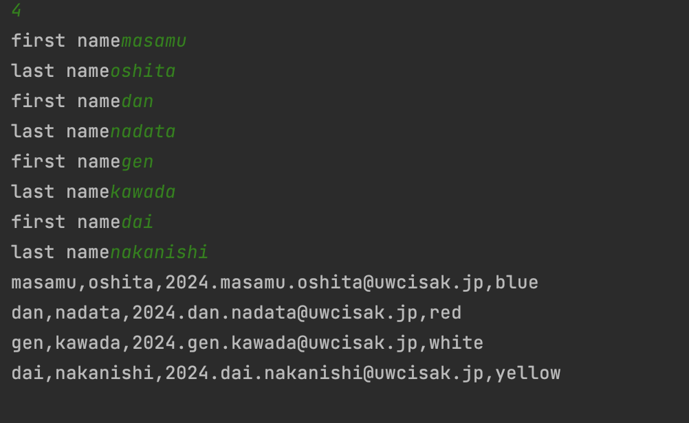

```.py
num = int(input())
fname = []
lname = []
for i in range(num):
    fname.append(str(input('first name')))
    lname.append(str(input('last name')))
c = len(fname)
for a in range(c):

    if a % 4 == 1:
        color = 'red'
    if a % 4 == 2:
        color = 'white'
    if a % 4 == 3:
        color = 'yellow'
    if a % 4 == 0:
        color = 'blue'
    print(f'{fname[a]},{lname[a]},2024.{fname[a]}.{lname[a]}@uwcisak.jp,{color}')
```

